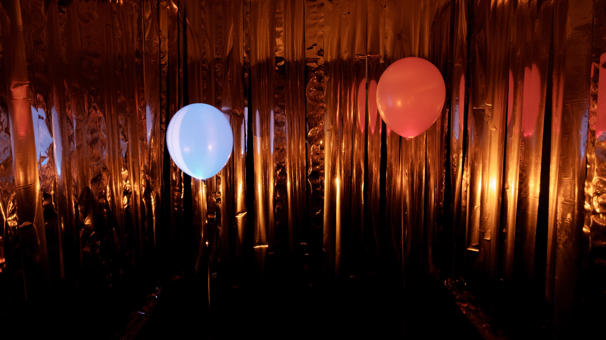
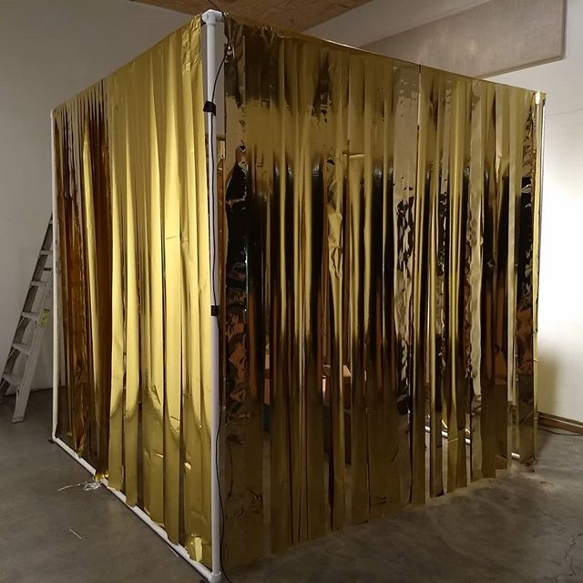

**Saxorcism**, *2016*  

 Winner of a 2017 Artist Research and Development grant
from the Arizona Commission on the Arts.

Saxorcism is a 4-channel reactive sound installation where the audience is drawn into a permeable cube and immersed in a shifting soundscape from all sides. 
Every sound originates from recordings of saxophones made and manipulated by the artist. The audience is
invited to alter what they are hearing via physical interaction with two glowing balloons hovering within
the space that are constantly varying different aspects of the aural environment. 

<iframe style="border: 0; width: 100%; height: 120px;" src="https://bandcamp.com/EmbeddedPlayer/album=1195361010/size=large/bgcol=333333/linkcol=e99708/tracklist=false/artwork=small/transparent=true/" seamless><a href="https://ruffidyll.bandcamp.com/album/saxorcism">Saxorcism by Ruff Idyll</a></iframe>

Saxorcism resides at the tangled nodes of composition, sculpture, collective improvisation, and synthetic
 field recordings. The sounds heard in the piece are never exactly the same twice, and what the audience
  hears is completely dependent on how the audiences decides to be listeners.  It questions notions of what
constitutes the authentic sound of an instrument, and the frameworks we use to judge musical composition
and virtuosity.